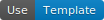

# PlaguBot

## For users

Template: [](https://github.com/InsanusMokrassar/PlaguBotBotTemplate/generate)

You can create your bot using
[this template](https://insanusmokrassar.github.io/PlaguBotBotTemplate/) by following of its instructions

## For developers

| Template: | [](https://github.com/InsanusMokrassar/PlaguBotPluginTemplate/generate) |
|-----------|-----------------------------------------------------------------------------------------------------------------|
| Bot version: | [](https://maven-badges.herokuapp.com/maven-central/dev.inmo/plagubot.bot) |
| Plugin version: | [](https://maven-badges.herokuapp.com/maven-central/dev.inmo/plagubot.plugin) |

That is a set of libraries for plagubots. Look at the
[PlaguBot Plugin template](https://insanusmokrassar.github.io/PlaguBotPluginTemplate/) to find how to create your bot.

### Technical help

#### FSM

In this bot has been used variant with FSM. That means that you may use all the [Behaviour Builder with FSM](https://bookstack.inmo.dev/books/telegrambotapi/page/behaviour-builder-with-fsm) functionality. In case you wish to setup states repo, you should use the next code in the `setupDI` of your plugin:

```kotlin
single<StatesManager<State>> {
    // setup your manager and return here
    // Default is:
    DefaultStatesManager(
        InMemoryDefaultStatesManagerRepo()
    )
}
```

Besides, you may setup handling errors lambda in the same function:

```kotlin
single<StateHandlingErrorHandler<State>> {
    { state, e ->
        logger.eS(e) { "Unable to handle state $state" } // logging by default
        null // you should return new state or null, default callback will return null
    }
}
```

#### Subcontext initial actions

Bot will take all the `CombinedSubcontextInitialAction.SubItem`s from `Koin` to include it in root of
`behaviourBuilder`. To create your own subitem:

```kotlin
singleWithRandomQualifier<CombinedSubcontextInitialAction.SubItem> {
    CombinedSubcontextInitialAction.SubItem {
        // do some action or throw error to rerun on next round
    }
}
```
